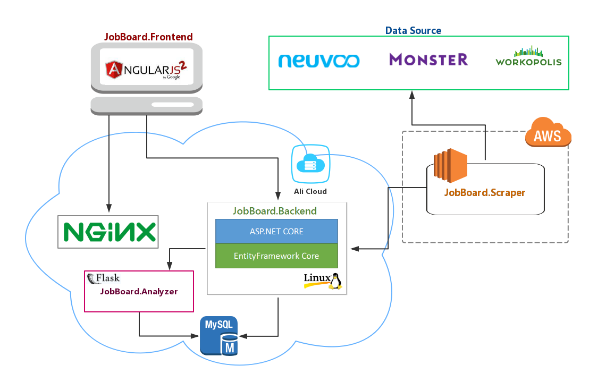
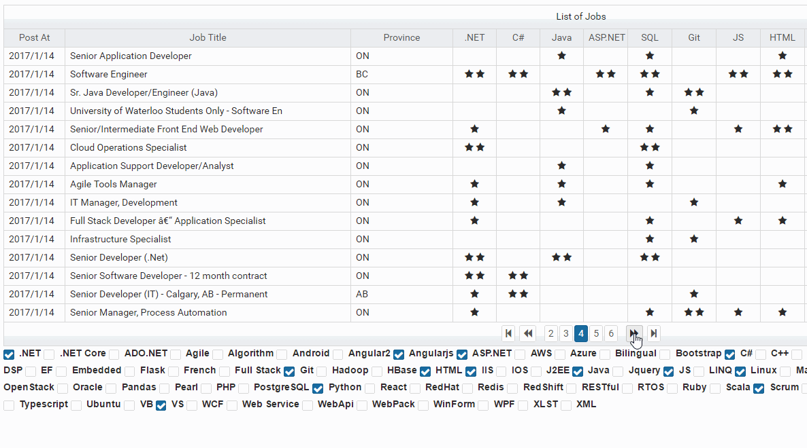

# jobboard
This is a full stack project based on ASP.Net Core(on Linux)  + Angular2 + Python.  
This application automatically retrieves Canadian job opportunities from several websites, analyze the requirement description, extract required 
competencies and level of experience, display the results in a "car comparison" way.

======= 

##Table of Content
-----------
* [System Design](#system-design)
* [Demo](#demo)
* [Motivation](#motivation)

##System Design  
-----------
It consists of 4 subsystems. Each reside in a separate repository. (Click the subsystem name can go to its repository)

1. __jobboard.scraper__

   `Python` `Selenium` `BeautifulSoup4` `AWS EC2` `RHEL`  
   A python scraper deployed on AWS EC2 (Linux). 
   It regurlarly fetch recruiting information from several Canadien recruitment website,
   such as Monster.ca, Neuvoo.ca, Workopolis.ca
   It then sends the raw information to jobboard.backend.

2. [__jobboard.backend__](https://github.com/CG0323/jobboard.backend)  

   `.NET Core` `EntityFramework Core` `MySql` `AliCloud` `CentOs` `Code First` `AutoMapper`  
   A REST data service built with ASP.NET Core + EntityFramework Core + MySql, deployed on AliCloud CentOs 7 instance.
   It serve as the data persistance service for jobboard.scraper and the backend for jobboard.frontend.

3. [__jobboard.analyzer__](https://github.com/CG0323/jobboard.analyzer)    

   `Python` `Flask` `Text Processing` `MyPy`  
   A python flask lighweight web service.
   It acts as a background worker which analyzes the raw recruitment description, analyze required skills as well as the level 
   of skills.Everytime a new recruiting post is sent to the backend, the analyze service will be triggered to process the text,
   extract desired information from unstructured text and save the result into MySql data tables.

4. [__jobboard.forntend__](https://github.com/CG0323/jobboard.frontend)  

   `Angular2` `Primeng`   
   Angular2 single page application, deployed on Nginx.
   Users (my friends and I) can view the latest job opportunities in a "Car Comparison" way, quickly view the required competencies
   before openning the detailed job page. Skill columns are customizable. Users can also add/edit skill detecting rules.
   Some statistic features are also available.

##Demo
--------
[Demo Website](http://jobwatch.kifugo.com) (server in China, so not that fast...)

##Motivation
--------